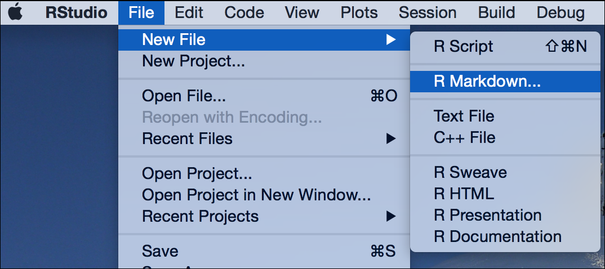
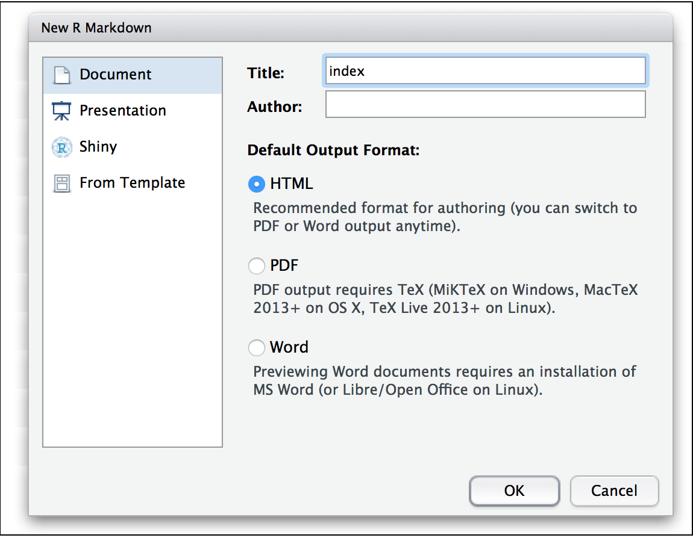
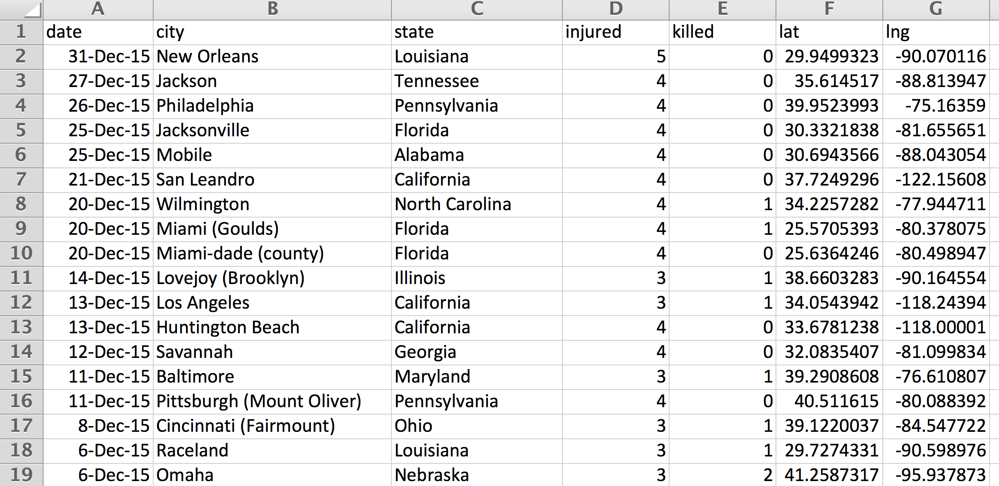

Mapping Shootings
=================

Coding skills don't just allow you analyze data -- they enable you to communicate important information to broad audiences. In this exercise, you'll create a report of this crowdsourced <a href="http://www.shootingtracker.com/wiki/Mass_Shootings_in_2015" target="_blank">mass shooting data</a> from 2015. This project will challenge you to apply the skills you've acquired thus far towards independently building a report about a dataset.

This is an opportunity for you to explore a dataset, and communicate the insights that you find most important. The format of the report is up to you, but it must include the following:

### Summary information

To start your report, you should summarize relevant features of your dataset. Write a paragraph providing a high-level overview of shootings in the US, based on the dataset. This should provide your reader with a sense of scale of the issue (i.e., how many shootings occurred, how many lives were lost, the cities that were most affected, etc.). You should also provide a summary table that provides an aggregated set of information to your user.

### Description of a particular incident

A paragraph of in-depth information about a particular shooting. You should provide your reader with relevant information from the dataset, such as the date and location of the incident, as well as the number of people impacted (injured, killed). Feel free to include other resources if you find it appropriate.

### An interactive map

While maps are not always the most appropriate visual representation of geographic data, they are extraordinarily popular and attract broad audiences. You'll build an interactive map that shows a marker at the location of each shooting. On your map, manipulate the appearance (size, color, etc.) of the markers based on the underlying dataset (\# injured, \# killed, etc.). The map should be appropriately labeled, and relevant information should be shown to the user when they hover over each point.

### An interactive plot of your choice

In addition to the interactive map, you will build an additional interactive plot of your choice. The `plotly` library has a [ton of examples](https://plot.ly/r/#basic-charts) that you can be inspired by. As you create your chart, be sure to consider what questions it answers for your audience. Similarly to your map, you should integrate your plot seamlessly with the rest of your report, and reference/describe it in your text.

Expectations
------------

At this point in the quarter, we expect you to be following the *best practices* we've incorporated into the class. This means:

-   Proper use of libraries such as `dplyr` for data wrangling
-   Structuring your code so that if the data changes, you can easily update your **entire** report
-   Leveraging markdown syntax to provide structure to your report
-   Clearly commenting and properly organizing your code
-   Writing functions to encapsulate chunks of code that you use more than once
-   Avoiding the creating of variables that are unnecessary for your analysis/report
-   Creating appropriate labels for your visualizations

Resources
---------

The following resources may be helpful for getting started with your project. As always, google and stackoverflow will likely be needed to supplement this information when you run into specific problems:

-   R plotly graphics [reference](https://plot.ly/r/reference/)
-   Bubble map [example](https://plot.ly/r/bubble-maps/)
-   Bubble map [documentation](https://plot.ly/r/reference/#scattergeo)
-   Documentation for manipulating the visual representation of [markers](https://plot.ly/r/reference/#scattergeo-marker) on a bubble map
-   Scatterplot [documentation](https://plot.ly/r/reference/#scatter) (though your second plot **does not** have to be a scatter plot -- this is just an example)
-   Chart layout [documentation](https://plot.ly/r/reference/#layout)
-   RMarkdown [documentation](http://rmarkdown.rstudio.com/)

Set-up
------

At this point, you should feel comfortable forking and cloning this repository. If you've forgotten the steps, refer to the previous assignments.

-   Fork this repository, then clone your forked repository (*not* my original one) to your machine

In this assignment, you'll be creating a new file from scratch (rather than editing a pre-existing file in the repository). You should use RStudio to create a new R Markdown file with extension `.Rmd`. You should call this file `index.Rmd` to facilitate easily hosting your project on **GitHub Pages**. To create a new `.Rmd` file, simply select it from the File menu in RStudio:



You will then be prompted to create a new `.Rmd` document. You should give it the title `index`, and keep the other defaults selected as seen here:



RStudio will create a document for you with some skeleton code in it. You should save this file as `index.Rmd` in your repository. This is a particular type of Markdown document that allows you to execute R code within it, and refer to your R variables within the document (which is supremely powerful).

Before diving in, make sure you install and read in the following packages:

-   `knitr`
-   `plotly`
-   `dplyr`
-   Any other packages you would like to use

**Note**: You may want to perform some initial analysis in a separate `analysis.r` file, then read that information into your `Readme.Rmd` file to better organize your workflow.

Using R Markdown
----------------

As a refresher from the previous assignment, you can embed an R code chunk by wrapping some R code with three back ticks (```` ``` ````) at the start and end of a code block.

<pre>
  ```&#123;r}
  x <- 1
  ```
</pre>
If you don't want the R code to appear in your document, you can simply include the `echo=FALSE` parameter.

<pre>
  ```&#123;r, echo=FALSE}
  # This would not be printed to your Markdown file once rendered.
  x <- 1
  ```
</pre>
Conversely, if you would like to show R code, but not actually execute it, the `eval=FALSE` parameter prevents the R code from actually running.
<pre>
  ```&#123;r eval=FALSE}
  # The variable x would not be created, but this would appear in your Markdown document for your user to see.
  x <- 1
  ```
</pre>
See the <a href="http://rmarkdown.rstudio.com/" target="_blank">documentation</a> for more guidance.

Mass shooting data
------------------

In order to make an interactive map of your data, you'll obviously need to read it into R. There is already a file `Mass-Shooting-Data.csv` inside of the `data/` directory for you to use. This data originally was crowdsourced on <a href="http://www.shootingtracker.com/wiki/Mass_Shootings_in_2015" target="_blank">this website</a>, though I've added latitude and longitude to make mapping easier (if you're curious how I did that, check out <a href="http://github.com/mkfreeman/geolocate-shootings" target="_blank">this repo</a>). The data is in the following format: 

Create a gh-pages branch
------------------------

Similarly to last week, we'll create a `gh-pages` branch so that our final product can be posted on the web. Here's the syntax you'll want to use in your terminal:

<pre>
# Get into your repository
cd a6-mapping-shootings

# Add and commit changes to your current (master) branch
git add .
git commit -m "Commit message goes in here"

# Create and checkout a new branch called 'gh-pages'
git checkout -b gh-pages

# Push all changes (including your new branch) up to GitHub
git push --all
</pre>
You should now see your `index.html` file up on the web at 'your-username.github.io/a5-github-report'.

Submission
----------

Before submitting your assignment, please edit this `Readme.md` file to answer the following questions (**please** delete the instructions above, leaving only the answers to these questions):

##### 1. Did you receive any help from others (classmates, etc)? If so, please list who.

> No

##### 2. Approximately how many hours did it take you to complete this challenge?

> 7

##### 3. On a scale of 1 (too easy) to 10 (too challenging), how difficult was this challenge?

> 6

##### 4. Did you encounter any problems in this challenge we should warn students about in the future? How can we make the challenge better?

> No specific problems, had to play around with the plotly to get the interactive graphs.

Please submit this GitHub repository to <a href="https://canvas.uw.edu/courses/1023398/assignments/3077686" target="_blank">Canvas</a> as your assignment, and thanks for your hard work!
